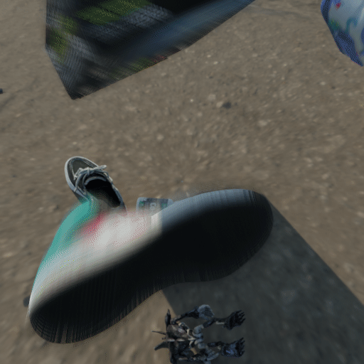

# Optical Flow Prediction


For optical flow prediction we use the MOVi-F dataset which is explained in [challenges/movi](../movi/README.md).
MOVi-F is identical to MOVi-E except that it adds a random amount of motion blur to each video and was rendered in 512x512 resolution (with downscaled variants for 256x256 and 128x128).

Generate single scene with the [movi_def_worker.py](../movi/movi_def_worker.py) script:
```shell
docker run --rm --interactive \
  --user $(id -u):$(id -g)    \
  --volume "$(pwd):/kubric"   \
  kubricdockerhub/kubruntu    \
  /usr/bin/python3 challenges/movi/movi_def_worker.py \
  --camera=linear_movement
  --max_motion_blur=2.0
```
See [movi_f.py](../movi/movi_f.py) for the TFDS definition / conversion.

Data is located at [gs://kubric-public/tfds/movi_f](https://console.cloud.google.com/storage/browser/kubric-public/tfds/movi_f) and can be loaded with:
``` python
ds = tfds.load("movi_f", data_dir="gs://kubric-public/tfds") 
```